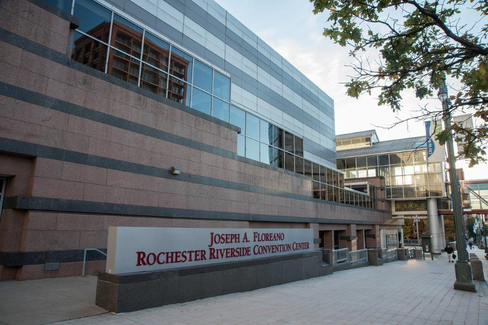

<!-- Slider Start -->
<section id="slider">
  

    

      

        

          <h1 class="animated fadeInUp text-center">ROCHESTER SECURITY SUMMIT {{ site.current_year }}</h1>
          
ollections.confrences[site.current_year].theme

          
October 25-26, 2023 
          Rochester Riverside Convention Center

        

      

    

  

</section>

<section id="conference" class="clearfix">
	

		<h1>RSS:{{ site.current_year }}</h1>
		<h2 class="conf-details-dates text-center">Wednesday, October 25 and 
		Thursday, October 26, 2023</h2>
		
Joseph A. Floreano Rochester Riverside Convention Center 
		Rochester, NY

	

	<aside id="tickets" class="col-md-6">
		
		<h1>Tickets</h1>
		<ul class="ticket-options">
			
		  <li>
		    <h2>Early Bird Registration</h2>
		    
$150.00

        
Limited availability. First come, first served.

      </li>
      
      
      <li>
      	<h2>Standard Registration</h2>
        
$250.00

        
Sale ends on 10/06/2023

      </li>
      
      
      <li>
        <h2>Late Registration</h2>
        
$350.00

        
Available starting 10/06/2023, until sold out

      </li>
      
      </ul>
      
<a class="btn btn-lg btn-primary pt-5 pb-5 " href="https://events.eventzilla.net/e/rochester-security-summit-2023-2138587562">Purchase Tickets</a>

			
			
			<h1>Sold Out</h1>
			
RSS:{{ site.current_year }} has sold out

			
			
			<h1>RSS:{{ site.current_year }} Has Concluded</h1>
			
We hope to see you next year.

			
    </aside>
</section>


<section id="app" class="clearfix">
  <h1 class="sr-only">Get our app</h1>
  
<strong>Get our full program via our mobile event app:</strong>

  <ul class="app-links">
  	<li></li>
  	<li></li>
  	<li><a href="{{ site.app_web_url }}" target="_blank" class="btn btn-lg btn-primary">Or View In Your Browser</a></li>
  </ul>
</section>


<section id="about" class="clearfix">
	
Since 2006, the Rochester Security Summit has been a leading regional event that brings together a broad range of experts and professionals from the field of information security. Held annually during National Cyber Security Awareness Month, it serves as a community focal point for education and awareness; fostering discussion, knowledge sharing, and networking to help drive innovation and address the evolving challenges in the security landscape. From emerging trends to practical insights, our goal is to empower attendees with the latest information and strategies to enhance their cybersecurity practices.

	
The Rochester Security Summit is brought to you by the <a href="https://www.rocissa.org" target="_blank">Rochester Chapter</a> of the <a href="https://www.issa.org" target="_blank">Infomation Systems Security Association International (ISSA)</a>.

</section>

<!-- <section id="announcements">
	

		
## Interested in helping out with RSS:2022?

Please let us know at [info@rochestersecurity.org](mailto:info@rochestersecurity.org).
    
	

</section> -->


    
    
    
    <section id="keynotes" class="clearfix">
	    

		    <h1>RSS:{{ site.current_year }} Keynote Speakers</h1>
		    
		      

            

            	
                <h2><a href="{{ keynote.data.permalink }}">{{ keynote.data.name }}</a></h2>
             	
                <h2>{{ keynote.data.name }}</h2>
             	
            

            
                
<em>{{ keynote.data.professional_title }}</em>

            
            
              

              
{{ keynote.data.intro | markdownify }} [<a href="{{ keynote.data.permalink }}">more</a>]

            
              
{{ keynote.data.intro | markdownify }} [<a href="{{ keynote.data.permalink }}">more</a>]
              

            
          

        
      

	  </section>
	  



<section id="location" class="clearfix">
	  

		  <h1>Location</h1>
		  
		  

		  	<h2>Conference Venue</h2>
		  	

	      <h4 class="text-center">Joseph A. Floreano Rochester Riverside Convention Center</h4>
			  
125 East Main Street  
			    Rochester, NY USA 14604

			  
<a href="https://www.rrcc.com" target="_blank">www.rrcc.com</a>

			  
<a href="https://www.rrcc.com/index.cfm?Page=Directions" class="btn btn-lg btn-primary">Driving Directions</a>

		  

		  

		  	<h2>Hotel Accommodations</h2>
		  	<ul class="hotellist">
		  		
		  	</ul>
		  	
		  	  <h2>Parking</h2>
		  	  
Confrenece participants should park in the South Ave Garage, located one block east of the convention center.  The garage is connected to the convention center via a skywalk on level three. <strong>Be sure to bring your ticket with you for validation at the conference office, located outside the Grand Lilac Ballroom.</strong>

		  	
		  

		  
		  

		  	<h2>Conference Venue</h2>
		  	  

		  	  	

		  	  

		  	  

		  	  	<h4 style="margin-top: 50px;">Joseph A. Floreano 
		  	  	Rochester Riverside Convention Center</h4>
			      
125 East Main Street  
			        Rochester, NY USA 14604

			      
<a href="https://www.rrcc.com" target="_blank">www.rrcc.com</a>

		  	  

		  

		  
		  

		  	<h2>Hotel Accommodations</h2>
		  	<ul class="hotellist">
		  		
		  	</ul>
	  

	  
	

</section>


<section id="cpe">
	<h1>Continuing Education Credits</h1>
	
Attending Rochester Security Summit sessions satisfies continuing education requirements for a number of professional certifications. Certificates of attendance are provided to participants. If you have misplaced your certificate, please send an email to <a href="mailto:cpe@rochestersecurity.org">cpe@rochestersecurity.org</a>.

</section>

<section id="sponsors">
	
	  <h1>Sponsors</h1>
	  <h2 class="text-center">RSS:{{ site.current_year }} Sponsors</h2>
	  
	  
	  

	  <h2 class="text-center">RSS:{{ site.previous_year }} Sponsors</h2>
	  
	  

	
	  <h1>RSS:{{ site.current_year }} Sponsors</h1>
	  
	  
	  

	
	  <h1>RSS:{{ site.previous_year }} Sponsors</h1>
	  
	  
	  
	
</section>

